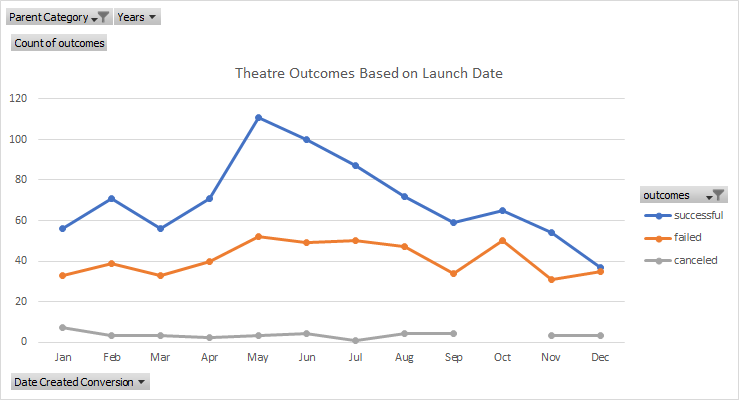
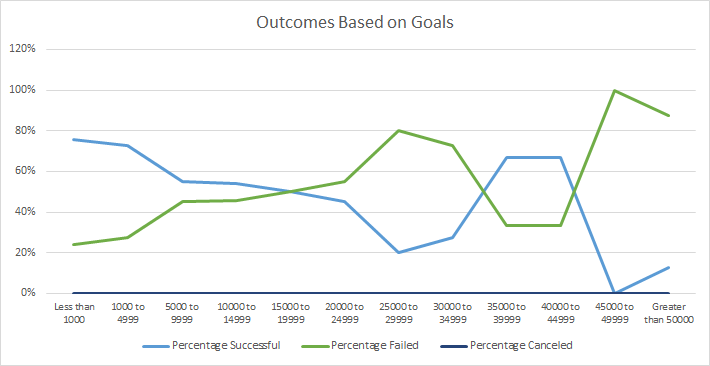

# Kickstarting with Excel

## Overview of Project

### Background

Louise is an up-and-coming play writer who wanted to start a crowdfunding campaign to fund her play *Fever*. She was hesitant to start her first fundraising campaign as she doesn’t have any prior experience. She asked me to analyze the crowdfunding data in Excel to provide some insights. Since the Fever campaign is close to fundraising goal, she wants some additional analysis to be done. 

### Purpose

I am analyzing crowdfunding dataset Kickstarter using Excel to see if there are any relationships and trends between the fields. This will ascertain if there are any specific factors that make a campaign successful. Will use these insights to help Louise plan her own fundraising campaign based on the previous successful campaigns in the same category. 

## Analysis and Challenges

I am doing two analyses to gain some further insights from the dataset. 
1.	Campaign Outcomes based on Launch Dates for Theatre category
2.	Campaign Outcomes based on funding Goals for Plays subcategory 

The analysis is presented in visual format (charts) so that these are easy to understand.  This could help Louise decide on the Launch Date and Funding Goal amounts for her future campaigns.

### Analysis of Outcomes Based on Launch Date

**General Observations:**

1.	There is a spike in number of Successful Outcomes towards the middle of an year. It reduces towards the end and is also low at the start of an year. 
2.	**May** has the highest number of the *successful outcomes* (111) for Theatre campaigns launched, followed by **June** (100). The lowest number of successful outcomes for campaigns launched are in **December** (37). 
3.	The numbers of *canceled* outcomes are very small for each month. The number of *failed* outcomes is lower than number of successful outcomes for every month.     
4.	The *difference* between the successful outcomes and failed outcomes is highest in **May**, followed by **June**. The number of successful outcomes are more than the double the number failed outcomes in these months.
5.	The number of successful outcomes is *almost the same* as failed outcomes in **December**. I.e. the difference is only 2.
6.	The *total number* of Theatre campaigns launched is highest in May (166), followed by June (153), according to given data. December has the lowest number of campaigns launched (75).

**Steps Performed:**

1)	Created a new Column in the Kickstarter sheet with a heading Years
2)	Populated the Years column using the =YEAR() formula referencing the Date Created Conversion column to get the year in which the campaign was launched.
3)	Next, I created a Pivot Table in new sheet and named this sheet Theater Outcomes by Launch Date   
4)	I dragged Parent Category and Years columns in the “Filters” area in PivotTable Fields.
5)	Dragged Outcomes in “Columns” area and Date Created Conversion in “Rows” area. The latter is converted into three items. I.e. Years, Quarters, and Date Created Conversions (Months). I only kept the Date Created Conversion and removed the other two.   
6)	Added Outcomes column in the “Values” area PivotTables Fields to get the count of Outcomes.
7)	This created a Pivot Table with launch date Months as first column followed by a column for each of the four outcomes showing their respective counts for each month. The Grand Total column appears at the end.
8)	Next, I filtered the Column Labels to show only “successful”, “failed”, and “canceled” outcomes. 
9)	Applied Parent Category filter show data for only Theatre campaigns.  
10)	Then I sorted the campaign outcomes in descending order so that the “successful” outcomes appear first out of three outcomes. 
11)	Created a line chart from pivot table to visualize the relationship between outcomes and launch date. Changed the chart title to “Theatre Outcomes Based on Launch Date”.
12)	Copied the chart and pasted it in Paint as image. Saved the image as PNG with the name Theater_Outcomes_vs_Launch.png

### Analysis of Outcomes Based on Goals

**General Observations**
1.	For fundraising campaigns for Plays, the percentage of successful outcomes are more than percentage of failed outcomes for Goal amounts <= 19999, and between 35000 and 44999.
2.	Percentage of successful outcomes are *highest* for Goal amount **Less than 1000** at 76%, followed by **1000 to 4999** (73%). 
3.	The success rate generally decreases with increasing Goal amount, but it *spikes* for ranges **3500 to 3999** and **4000 to 44999** with a percentage of successful outcomes at 67% each which is the third highest. 
4.	The Percentage of Successful campaigns are the *lowest* for Goal amount **Greater than 45000**
5. Percentage (and total number) of **Canceled** outcomes are zero for all Goal amount ranges.

**Steps Performed**

Given below are the steps I performed in order to do this analysis.
1.	Created a new sheet in Kickstarter and named it “Outcomes Based on Goals”
2.	In this new sheet, I created 8 columns with following headings:
*	Goal
*	Number Successful
*	Number Failed
*	Number Canceled
*	Total Projects
*	Percentage Successful
*	Percentage Failed
*	Percentage Canceled
3.	Then under Goal column, I created following dollar amount ranges to group projects based on their goal amounts:
-	Less than 1000
-	1000 to 4999
-	5000 to 9999
-	10000 to 14999
-	15000 to 19999
-	20000 to 24999
-	25000 to 29999
-	30000 to 34999
-	35000 to 39999
-	40000 to 44999
-	45000 to 49999
-	Greater than 50000
4.	Then I used the =COUNTIFS() function to populate the Number Successful, Number Failed, and Number Canceled columns to count the given outcome under each Goal range for “Plays” subcategory. 
5.	The criteria used in COUNTIFS() functions are finding the upper and/or lower limit of funding goal amount range, specific outcome based on the column, and subcategory equal to “Plays”.
6.	Then I used the =SUM() function to populate Total Projects column with the sum of the Number Successful, Number Failed, and Number Canceled columns.
7.	In Percentage Successful column, I used =Number Successful/Total Projects along with Percentage Style (%) to show the percentage of successful campaigns. Similar method is used for Percentage Failed and Percentage Canceled with using Number Failed and Number Canceled columns respectively.
8.	Then I inserted a Line Chart titled “Outcomes Based on Goals”. In the “Legend Entries (Series)”, I selected Percentage Successful, Percentage Failed, and Percentage Canceled. And in “Horizontal (Category) Axis Label” I selected the Goal amount ranges.
9.	Copied the chart and pasted in Paint as an image. Saved the image as PNG with the name Outcomes_vs_Goals.png

### Challenges and Difficulties Encountered

I didn’t face any big challenges in doing these analyses as I am already familiar with Excel and use it as a part of my job profile. However, given below are few difficulties that I think some Excel users might encounter. 
1.	Some users might find it difficult to implement multiple criteria in the COUNTIFS() functions. In “Outcomes Based on Goals" analysis the multiple conditions will include the goal amount range (upper and lower limits), campaign outcome, and subcategory which can be challenging for some.
2.	In “Theater Outcomes by Launch Date” pivot table, dragging the Date Created Conversion to Rows area splits it into three parts: Years, Quarter, and Date (Months). Some people may find this confusing.

## Results

### What are two conclusions you can draw about the Outcomes based on Launch Date?

We can conclude that:

1. **May** is the *best* month to start a theatre fundraising campaign. **June** is the *second best*.

2. **December** is *worst* month to start a theatre fundraising campaign. Also, it is not advisable to start the campaign in Nov, Jan, and March either.

### What can you conclude about the Outcomes based on Goals?

We can conclude that:

1. Fundraising campaigns for plays with Goal amount **<10000**, and between **35000 to 45000** have *high success rate*. Therefore, it is advisable to set the funding Goal within these ranges.

### What are some limitations of this dataset?

Given below are two limitations of the dataset.

*	Some of the campaigns included in the dataset are *old* and date as far back as 2009-10. If we are launching a crowdfunding campaign in 2021, these old records may prove to be *obsolete* dues to changes in technology and society in general. I think data for five years prior to the launch date will be more helpful. 
*	The data does not provide any *additional information* that could have influenced the outcome of the campaigns. For e.g., the demography the campaign is targeted to, marketing efforts, economic conditions, etc.  

### What are some other possible tables and/or graphs that we could create?

Mentioned below are two possible tables and graphs we could create.

1. We can create a table and graph for "Outcomes based on Campaign Duration".  This could be done by including an additional column *Campaign Duration* in Kickstarter and then using =DATEDIF() function to calculate the duration. 
2. For more details, we can also create a chart for "Plays Outcomes based on Launch Date" for subcategory Plays under Theatre. We can also do this by inlcuding the Subcategory as additional filter in "Theatre Outcomes based on Launch Date" chart
3. We can also show the percentages of outcomes in "Theatre Outcomes based on Launch Date" to show the proportion of each outcome and determine easily which months have higer rates of success.  
